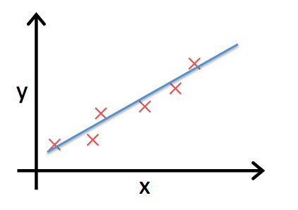

## 前言

這一系列是 Machine Learning 相關筆記，前情提要可以參考之前的文章 [Machine Learning 筆記 (1) – 簡介](http://www.icoding.co/2013/06/machine-learning-1-intro)。看完了對於 Machine Learning 的簡介之後，接下來我們要來進入真正的 Machine Learning 部分了。從這邊開始將不再輕鬆，會開始有些討厭的數學式子出現，也會需要一些基本的微積分。不過也唯有熬過這些，你才可以從嘴砲人晉升成為真正對 Machine Learning 略懂略懂的人。大家一起學習吧！

## Linear Regression with One Variable

讓我們考慮以下的問題：

	假設已知過去幾年信義區的房屋坪數和成交價，現在告訴你某間房屋的坪數，預測這間房子大概可以賣多少錢。
	
當然實際上房子的成交價格因素不僅僅是坪數大小而已，不過為了簡化問題，我們先從這邊開始。

首先讓我們再來複習一下關於 [Machine Learning 的分類](http://www.icoding.co/2013/06/machine-learning-1-intro)，因為我們這個問題有給予正確的答案，所以是屬於 "supervised  learning"。另外我們的問題是希望預測最後房子賣出的價格，所以屬於 "Regression Problem"。

### Model Representation

那麼讓我們正式開始來解這個問題吧！在這之前，讓我們來定義一些 Machine Learning 常用的 notations:

	m: number of training examples
	x: input variables/features
	y: output variables

在這邊，*x* 可以是一個變數或是多個變數，通常我們的 training examples 會用 *(x,y)* 來代表一組 training example。舉例來說，假設房價跟坪數的資料如下：

<table>
<thead>
<td>坪數</td>
<td>房價</td>
</thead>
<tbody>
<tr>
<td>38</td>
<td>4605</td>
</tr>
<tr>
<td>20</td>
<td>2033</td>
</tr>
<tr>
<td>32</td>
<td>3651</td>
</tr>
<tr>
<td>80</td>
<td>8730</td>
</tr>
</tbody>
</table>

在這邊，我們有 4 組 training examples (_m_=4) 組成了 **training sets**，4 組 training examples 分別為 (38, 4605)、(20, 2033)、(32, 3651)、(80, 8730)。通常，我們會用 (_x_(i), _y_(i)) 來代表第 _i_ 組的 training example。以這組例子來說，(_x_(1), _y_(1)) = (38, 4605)。_x_ 是坪數，_y_ 則是房價。

在這個問題當中，我們要做的事情基本上可以用下圖來說明：

首先，我們有了 training sets 之後，餵給我們的 Machine Learning Algorithm，接著由我們的演算法產生出一個 hypothesis function _h_，最後再用這個 hypothesis function _h_ 來根據房屋的坪數來預估價格。

在這邊，我們假設我們的 hypothesis function _h_ 會是線性的，也就是說 _h_Θ(_x_) = _Θ0+Θ1x_。我們的 Machine Learning Algorithm 就是要根據 training sets 找出 _Θ0_ 還有 _Θ1_ 的值。

### Cost Function

用圖示的方式來說明也許會更清楚，圖中每個 X 的都代表了一個 training example，而我們的任務就是要找到圖中的直線  _h_Θ(_x_) = _Θ0+Θ1x_。那麼要怎麼選擇  _Θ0_ 還有 _Θ1_ 的值呢？我們的目標是希望找出的 _Θ0_ 還有 _Θ1_ 可以讓每一個 _h_Θ(_x(i)_) 都跟 _y(i)_ 越接近越好。

我們會用到一般最常用的 square root error。我們的目的是最小化 _h_Θ(_x(i)_) 和 _y(i)_ 之間的 square root error，寫成數學式如下：

可以寫成

在這邊，我們會把 _J(_Θ0_, _Θ1_)_ 叫做 cost function。

### Gradient Descent Algorithm

到目前為止，我們把原本的 Machine Learning 問題轉為了一個數學問題，目標就是要最小化我們的 cost function。為了解決這個問題，一個簡單的想法可以是：

1. 先找個初始的 _Θ0_, _Θ1_
2. 一直更動 _Θ0_, _Θ1_ 的值，減少 cost function _J(_Θ0_, _Θ1_)_，直到我們找到最小值為止

不過問題來了，我們要怎麼樣可以知道 _Θ0_, _Θ1_ 要怎麼變化才可以減少 cost function 的值呢？還好早就有數值方法可以幫你這個忙！我們這邊會用到 Gradient Descent 來對 _Θ0_, _Θ1_ 做 update，演算法如下：

其中，&alpha; 是 learning rate，代表 *Θj* 更新的幅度。後面的

這項對於從前微積分還有一些印象的人應該知道這代表著 *Θj* 的 derivative。

那麼要如何找出 

 

呢？讓我們來做點簡單的數學推導

### 結論

